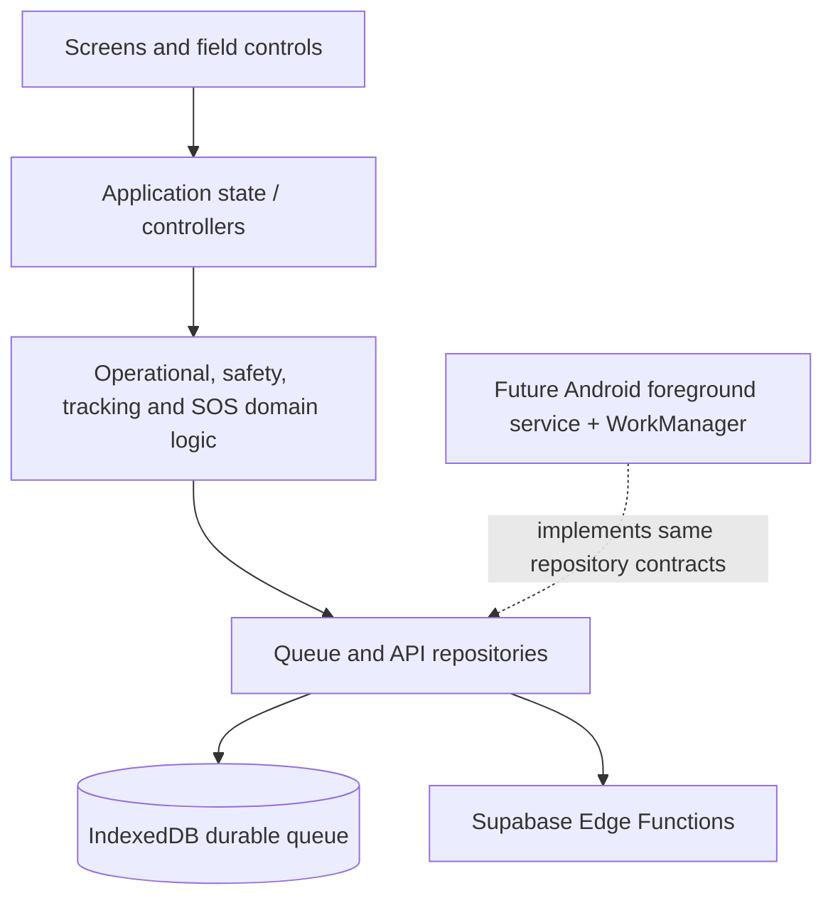

# Rescuer application architecture

## Overview

The new client is a narrow-screen React/PWA foundation. It is deliberately separate from the imported Supabase Edge Functions so presentation does not contain privileged database logic and the existing DMT functions remain untouched.

Operational and safety state are independent. SAFE confirmation changes only `safety` and its timer. SOS sets safety to `SOS` and never replaces operational status.

## Screen inventory

All screens are reachable from the home actions, bottom navigation, or supporting links:

1. Home — rescuer identity, two independent states, tracking health, mission summary, and five dominant actions.
2. Mission — assignment, team, task, route, contacts, timing, vehicle, and duty transitions.
3. Map — Leaflet/OpenStreetMap with individually selectable operational layers.
4. Check In — seven presets, optional note, GPS/time, and offline queue semantics.
5. Messages — separate Command/Team contexts and acknowledgement-required urgent Command message.
6. SOS — raised, queued/delivery, acknowledgement, and escalation information.
7. Activity Timeline — immutable structured events.
8. Profile — Scout identity, medical/skills/emergency fields and device approval.
9. Tracking & Privacy — reason, permission, interval, health, battery and queue state.
10. Offline Sync — durable queued counts and controlled retry.

## State models

Operational: `AVAILABLE | ALERTED | EN_ROUTE | ON_MISSION | RETURNING | OFF_DUTY`.

Safety: `SAFE_CONFIRMED | SAFE_DUE | SAFE_OVERDUE | SOS`.

SAFE defaults to an 8-hour interval with a configurable 30-minute overdue grace. The policy is centralized in `src/domain/policy.ts`. Command-directed non-linear operational transitions remain representable.

Tracking health: `HEALTHY | DELAYED | LOST | PERMISSION_OFF | LOCATION_OFF | OFFLINE_QUEUED`. Active thresholds are healthy through 3 minutes, delayed after 3 through 10 minutes, and lost after 10 minutes. Offline local capture with queued points is shown as `OFFLINE_QUEUED`, never falsely as tracking lost. Active/standby intervals are centrally configured at 15 seconds and 2 minutes.

## Offline synchronization

Queue records are persisted in IndexedDB, not memory alone. Every record separates `capturedAt` from the eventual `uploadedAt`. User actions are locally accepted first and show an explicit saved/queued outcome. The repository supports GPS, check-ins, media, SOS, and events. A production sync worker should apply controlled exponential retry and only remove a record after server confirmation.

## SOS architecture

The SOS control requires an uninterrupted 3,000 ms pointer hold and resets on release, leave, or cancellation. A confirmed SOS creates local safety/activity state and a durable queue record containing rescuer, team, phone, unchanged operational state, latest GPS/accuracy/time, battery, network state, and creation time. UI keeps it raised until Command acknowledgement and exposes the configured 90-second escalation policy. Acknowledgement is distinct from resolution and does not erase history.

## API integrations and backend gaps

Reused/adapted endpoint: `rescue-tracker-api` for device-token-authenticated location, messages, mission photos, and mission lifecycle. Existing `rescue-deployment-api`, `rescue-tracking-consent-api`, and `rescue-team-leader-roster` remain available and unmodified.

The existing API is **not compliant with the approved independent state model**: `safe` writes `mission_status='safe'`, and `sos` writes `mission_status='sos'`. It also combines message read and acknowledgement. The client therefore does not claim production integration for those actions. Required backend work:

- Add independent operational, safety, and SOS status fields/tables plus acknowledgement/escalation timestamps.
- Add assignment/team/area/task/asset entities instead of adding assignment data to `rescue_devices`.
- Add first-class check-in, evidence category/video, urgent message acknowledgement, and sync idempotency APIs.
- Add `uploaded_at` where needed while preserving capture timestamps.
- Return the complete profile, assignment, messages, activity, and Command acknowledgement state.

No service-role credential is used by the client. `VITE_RESCUE_API_URL` is a public endpoint; approved device tokens must be obtained through the existing login flow and kept out of source control.

## Platform limitations and native Android path

A browser/PWA cannot guarantee continuous background GPS after suspension, process termination, OS battery optimization, or device restart. The UI states this limitation and does not simulate guaranteed tracking. Production Android should implement the same boundaries with a foreground location service and persistent notification, encrypted token storage, a Room-backed queue, WorkManager retry, connectivity observation, and explicit approved-mission start/stop commands.

## Testing and verification

Automated tests cover independent state behavior, SAFE timer boundaries, GPS health thresholds, offline-queued distinction, durable capture timestamps, queue removal, SOS hold policy, and activity creation. Manual verification should exercise the Issue #2 sequence with browser network toggling and the SOS hold interaction at 360, 375, 390, and 412 px.

## Remaining work

- Implement approved-device login/registration screens against the existing functions.
- Implement real geolocation watch, Battery Status feature detection, media capture, and background-capable native adapters.
- Complete the backend gaps above before field deployment.
- Add server-issued assignment/map data and an idempotent retry contract.
- Conduct outdoor accessibility, large-text, poor-network, battery, and real-device safety testing.

This branch is a working interaction and architecture foundation, not a claim of production rescue readiness.
